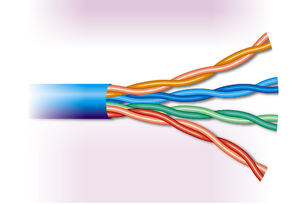
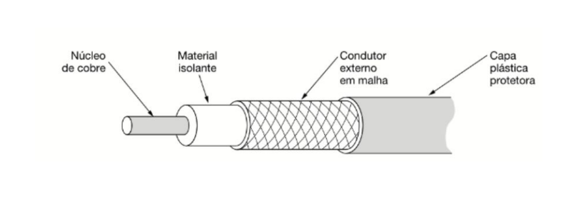
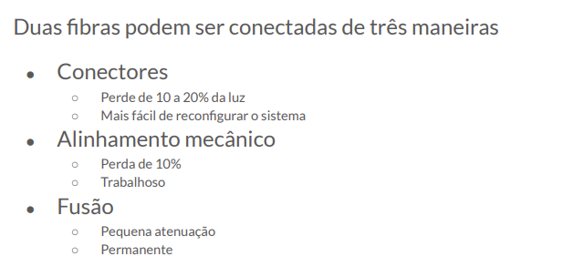
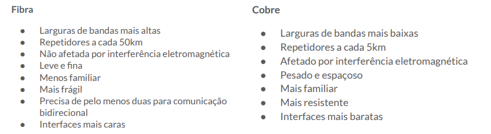

## Aula 3 
## 11/08 

## Camada Fisica
    - não é uma camada fisícia 
    - transmite o fluxo de bits de uma maquina para outra 
    - varios meios fisicos 

## Meios de transmissões guiados 
    - ex: fio ou cabo 
        - tem um meio fisico por onde a mensagem pode ser guiada 
    
    - qualquer maneira de levar um dado pra algum destino é uma transmissão de dados 

## Curiosisade
    - dois pares de fio em parelelo formam uma antena 
        - capaz de captar qualquer sinal eletromagnético 

## Pares Trançados 

    - são trançados para evitar interferencia eletromagnética 
    - podem se estender por quilometros de distancia 
    - podem transmitir dados analogicos ou digitais 
        digitais: usam valores separados ou fixos, representados por numeros (geralmente 0 e 1)
        analogicos: usam dados continuos, que mudam sem salto (como ondas)

    - Ethernet 100Mbps 
        - usa dois pares 
        - um para cada direção da comunicação 

    - Ethernet 1Gbps 
        - usa quatro pares 
        - todos para as duas direções   

## Cabo Coaxial 
    - melhor blindagem 
    - maior largura de banda 
    - distancia mais longas com velocidades mais rapidas 

    - a malha de condutor impede a passagem de campos eletromagnéticos
        - ex: isso que os microondas usam para não sair sinais de radiação
            bloqueia a radiação porém a luz passa

    - esses cabos estão sendo substituidos pela fibra ópticas 

## Fibra Óptica 
    - uma das maiores evoluções tecnologicas da comunicação 
        - fio fino de vidro (ou plástico) usado para transmitir dados através de luz
        - geralmente usa luz infravermelha (menos atenuação no vidro)
        - a luz viaja por reflexão total interna, "quicando" dentro da fibra sem escapar
        - os dados são codificados como pulsos de luz (aceso/apagado = 1/0)
    - para evitar locação da fibra dentro dos cabos:
        é colocado um gel por dentro do cabo 
    - fibra optica é caracterizada como: SIMPLEX ou pode ser DUPLEX 

    - melhor maneira é através de fusão 
        - porém é uma mudança permanente 
    - NÃO TEM INTERFERENCIA ELETROMAGNÉTICA     

## Diferença Fibra vs Cobre 

    
    - mil pares trançados de 1 km pesam 8 toneladas. Duas fibras tem mais capacidade e pesam 100kg 
    

           